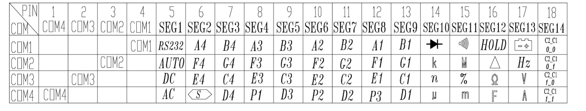
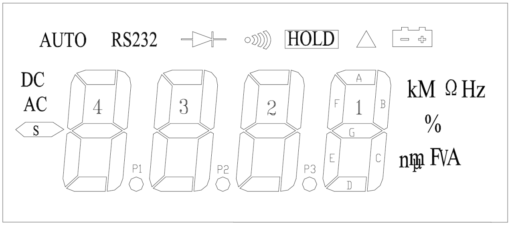

# BTMETER Python Decoder
This is a python decoder for BTMETER BT-90EPC (and others) implemented by Kevin Nassery of RTXSecurity. The code is available for all purposes.

## About
The [BTMeter](https://www.amazon.com/BTMETER-Multimeter-Auto-Ranging-Resistance-Measuring/dp/B07C238GTP/ref=asc_df_B07C238GTP/?tag=hyprod-20&linkCode=df0&hvadid=242027088707&hvpos=&hvnetw=g&hvrand=3103974879487195685&hvpone=&hvptwo=&hvqmt=&hvdev=c&hvdvcmdl=&hvlocint=&hvlocphy=9019670&hvtargid=pla-523440179742&th=1) is an inexpensive multimeter that provides a RS232 mechanism via a USB FTDI cable. The meter speaks an RS232 protocol that correlates bits to the various LCD segments.

## Reference material
There is a windows application, but I had no windows machine for testing so I used trial an error and then was eventually abel to make sense of the 
brief [description of the protocol](https://asset.conrad.com/media10/add/160267/c1/-/en/000123295DS01/datasheet-123295-voltcraft-vc-840-digital-multimeter-4000-counts.pdf) provided by voltcraft.

## "Message" format

Initially, it was unclear to me how to determine the boundaries of the 14-byte message as there is no deliminator sequence (aka a start byte) to sync to. 

Other serial decoders for older voltcraft multimeters I looked at leveraged a delay from the meter to sync, however, my meter generated a regular stream of bytes.

I tried looking for a consistent byte, a time delay, and other factors but none really appeared.

Eventually, I understood that the protocol used an ordering mechanism with the first hex digit of each byte to indicate it's placement in the message. This means you can scan for a "1" to find the first "segment" of the 14-byte message or an E for the last byte. 

A few points of clarity regarding that description:
* "Segments" means individual bytes of the 14 byte message.
* "COM4->1" describes 4 bits (the second digit). Each nibble is 1 if "high" and 0 if "low" and each bit corresponds to a physical LCD segment element.
* It's unclear what PINs are.

The most relevant usage of these two terms is in the message description:



* It's unclear what the first "4" greyed segments are,or PINS for that matter. Perhaps an older VC RS232 implementation used these.

The documentation described this as:
1X1,2X1,..EX1

-at first- I thought that indicated a multiplication rather than a concatenation. It is in fact, concatenation.

For example a byte: 0x17
is broken into two parts:
1 indicates the start of a message and segment 1

7 then provides 4 bits of details "known as coms" which are "1" if that part of the LCD is energized and "0" if not.

Based on known the map of LCD positions (provided above) you can decode the "screen" for logging or bench analysis:



The image above describes 4 digits of a seven segment LCD display with each segment lettered A-G (as notated) on digit 1.

For example a 0 in a 7 segment LCD has all elements energized except the "G" element so it could be described as "1111110" given string ABCDEFG. This is essentially what the Voltcraft protocol does, but the bits are scattered around the array and you have to collect them to decode the digit:

```
  self.digit4 = getdigit(
                        "%s%s%s%s%s%s%s" % (
                        signals[7][3],
                        signals[8][3],
                        signals[8][1],
                        signals[8][0],
                        signals[7][1],
                        signals[7][2],
                        signals[8][2])
                )
```

This code above does just this, it's plucking the correct bits for a digit and sends it to a function that will return the number that corresponds. The correct bits are notated above as A1 which resides at COM1 of Segment 8. In the signals array that is the 7th element, and COM1 is the 4th bit. Again, I don't know why the call these "COMs." There is very little text provided in the pdf.

Serial interaction is done using Pyserial which seems quite good.

```
ser = serial.Serial(
    port='/dev/cu.usbserial-221320',
    baudrate=2400,
    timeout=0,
    parity=serial.PARITY_NONE,
    stopbits=serial.STOPBITS_ONE,
    bytesize=serial.EIGHTBITS,
    dsrdtr=True,
    rtscts=False,
)
```
* You will need to adjust the device to your com port.
* These devices use 2400 baud.
* Some folks reported RTS off and DTS on being important.
* Timeout indicates that the serial read will "block" until a byte is found. This worked well in testing.

## Conclusions
I specifically purchased the BTMeter as an inexpensive way to "log" measurements over time. Alternative solutions exist such as building a custom monitor from an arduino and ADC but ADC ranges are limited, so a voltage divider circuit would also be necessary in many applications. 

Advanced instruments like an Analog Discovery 2 also provide good telemetry but there are many situations where leaving one for logging might not be viable.

In addition to the BTMeter, several instruments are also available such as a clamp AC/DC ammeter.